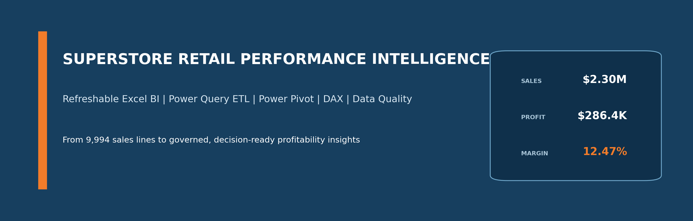
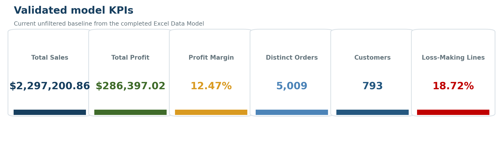
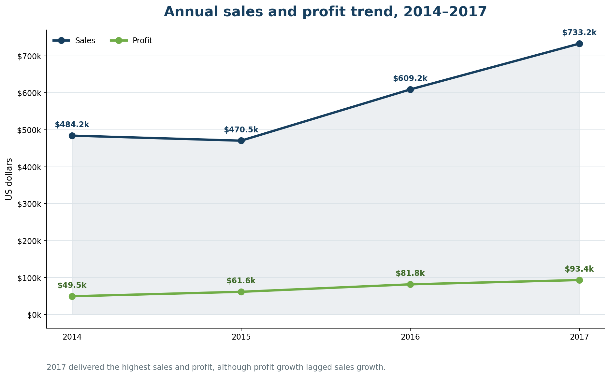
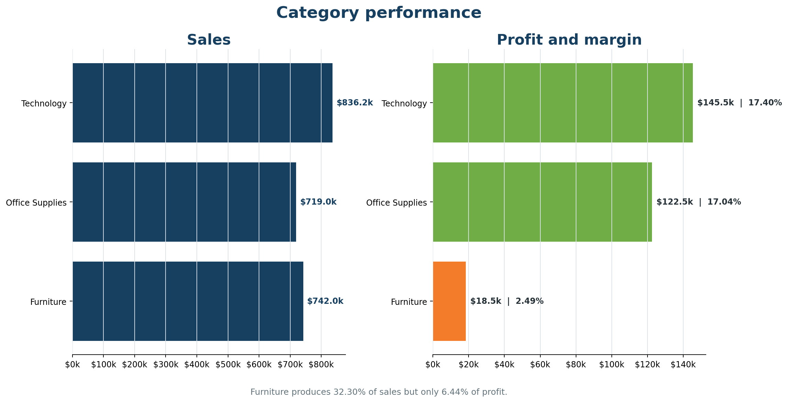
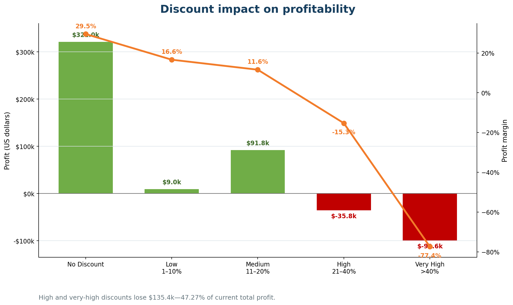
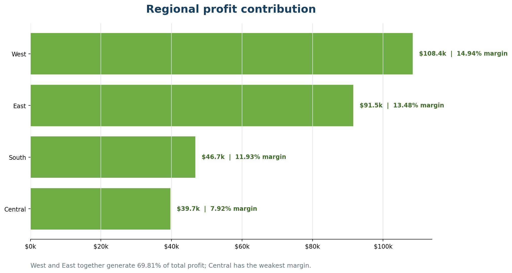
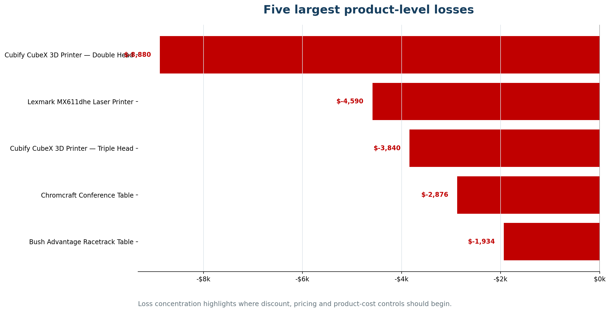

# Superstore-retail-performance-intelligence

  

 <strong>Transforming 9,994 retail sales lines into governed, refreshable and decision-ready business intelligence in Microsoft Excel.</strong> 

 <a href="workbook/Superstore_Retail_Performance_Intelligence_Excel_BI_v1.0.xlsx">Excel workbook</a> • <a href="docs/Superstore_Retail_Performance_Intelligence_Report.docx">Professional report</a> • <a href="#analytical-results">Analytical results</a> • <a href="#refresh-and-reproduction">Refresh instructions</a> 

About this project
Superstore Retail Performance Intelligence is an end-to-end Excel Business Intelligence project that replaces a static spreadsheet workflow with a refreshable analytical architecture. The solution uses Power Query for parameterized ETL, Power Pivot for relational modelling, DAX for reusable KPI calculations, and model-based PivotTables, charts, slicers and timelines for interactive reporting.

The project answers a commercially important question: why is the business creating revenue without creating enough profit? It combines sales, profitability, discount, customer, product, regional and data-quality analysis in one governed workbook.

Business objectives
The analysis was designed to answer:

How are sales, profit and margin changing over time?

Which categories, sub-categories and products create or destroy value?

How strongly do discounts affect profitability?

Which regions and customer segments contribute the most profit?

Which customers and products require profitability intervention?

Can the results be refreshed and reproduced with visible quality and audit controls?

Project scope
Item	Validated scope
Analysis period	3 January 2014–30 December 2017
Sales lines	9,994
Distinct orders	5,009
Customers	793
Valid rows	9,994
Rejected rows	0
Reporting currency	US dollars
Grain clarification: the source contains 9,994 order-line records, not 9,994 distinct transactions. Order-level KPIs use DISTINCTCOUNT(Order ID).

Tools and capabilities demonstrated
Layer	Implementation
Source control	Text parameter pSourcePath separates workbook logic from the CSV location
ETL	Power Query M for typing, trimming, standardization, validation and reusable staging
Data quality	PASS/REVIEW/FAIL checks, rejected-row register and row-count reconciliation
Data model	FactSales with DimDate, DimProduct, DimCustomer and DimLocation lookup tables
Measures	Centralized DAX measures in MeasuresHub
Reporting	Model-based PivotTables, charts, KPI cards, slicers and order-date timeline
Auditability	Refresh_Audit records source path, UTC refresh time, row counts and date coverage
Refreshable analytical architecture
flowchart LR
    A[Superstore CSV] --> B[Power Query ETL]
    B --> C[Validated staging]
    C --> D[(Excel Data Model)]
    D --> E[DAX measures]
    E --> F[PivotTables and charts]
    F --> G[Interactive dashboards]
    H[Data Checks and Refresh Audit] -. control .-> C
    H -. assurance .-> G
Relational model
erDiagram
    DimDate ||--o{ FactSales : "Order Date"
    DimProduct ||--o{ FactSales : "Product ID"
    DimCustomer ||--o{ FactSales : "Customer ID"
    DimLocation ||--o{ FactSales : "Location Key"

    FactSales {
        string Order_ID
        date Order_Date
        date Ship_Date
        string Product_ID
        string Customer_ID
        string Location_Key
        number Sales
        number Quantity
        number Discount
        number Profit
    }
DimDate[Date] → FactSales[Order Date] is the active reporting relationship. Ship-date analysis uses the alternative date relationship through dedicated DAX logic. MeasuresHub, Data_Checks and Refresh_Audit are support tables and do not behave as ordinary lookup dimensions.

Data preparation and quality controls
The Power Query pipeline:

imports the CSV through pSourcePath;

standardizes headers and trims text fields;

converts date and numeric fields to controlled data types;

validates identifiers, dates, quantities, discounts, sales and profit;

separates valid rows from rejected rows;

creates reusable fact and dimension queries;

records refresh metadata and row-count reconciliation.

The current model loads 9,994 valid rows and zero rejected rows. The overall DQ status remains REVIEW, not FAIL, because business-review checks identify 1,871 negative-profit lines and 127 high-sales outlier flags. These are analytical exceptions requiring investigation, not evidence of broken ETL.

Core DAX measures
Total Sales :=
SUM ( FactSales[Sales] )

Total Profit :=
SUM ( FactSales[Profit] )

Profit Margin % :=
DIVIDE ( [Total Profit], [Total Sales] )

Order Count :=
DISTINCTCOUNT ( FactSales[Order ID] )

Average Order Value :=
DIVIDE ( [Total Sales], [Order Count] )

Loss-Making Line % :=
DIVIDE ( [Loss-Making Line Count], [Sales Line Count] )
The completed model also includes time-intelligence, ranking, contribution, discount-diagnostic, data-quality and refresh measures.

Analytical results

  

Sales and profit over time

  

Sales reached $733,215.26 in 2017, the strongest year in the dataset.

2017 sales increased 20.36%, while profit increased 14.24%.

The slower profit growth indicates weaker conversion of incremental revenue into profit.

November 2017 recorded the highest monthly sales at $118,447.83.

July 2014 and January 2015 were the only loss-making months.

Category profitability

  

Category	Sales	Profit	Margin	Share of profit
Technology	$836,154.03	$145,454.95	17.40%	50.79%
Office Supplies	$719,047.03	$122,490.80	17.04%	42.77%
Furniture	$741,999.80	$18,451.27	2.49%	6.44%
Technology is the strongest category, while Furniture is the clearest structural weakness. Furniture generates 32.30% of sales but only 6.44% of profit, driven primarily by losses in Tables and Bookcases.

Discount impact

  

Non-discounted lines generate $320,987.60 of profit at a 29.51% margin.

Discounted lines produce 52.64% of sales but lose $34,590.58 in aggregate.

High and very-high discounts lose $135,376.06, equivalent to 47.27% of current total profit.

The high-discount margin is −37.32%.

Regional performance

  

West and East generate 69.81% of total profit. Central produces more sales than South but has the weakest regional margin at 7.92%, suggesting a pricing, product-mix or discount-control issue rather than a simple scale problem.

Product-level losses

  

The largest product-level loss is the Cubify CubeX 3D Printer Double Head at −$8,879.97, followed by the Lexmark MX611dhe at −$4,589.97. These products should be prioritized for discount, freight, supplier-cost and pricing review.

Recommendations
Priority	Recommended action	Success indicator
P1	Introduce approval and minimum-margin controls for discounts above 20%	High-discount margin improves; discounted profit becomes positive
P1	Review freight, supplier terms and discount practices for Tables, Bookcases and Machines	Lower loss amount and loss-line rate
P2	Review account-level profitability before approving customer-specific discounts	Higher profit per customer and customer margin
P2	Protect availability and promotion for profitable Technology and Office Supplies products	Stable contribution and in-stock rate
P3	Refresh, validate and archive the workbook monthly	Successful refresh, accepted DQ result and complete audit evidence
Reporting pages
Worksheet	Purpose
00_Control	Intended for user instructions, versioning and refresh ownership
01_Data_Quality	Quality-control summary and rejected-row register
02_Executive	KPI cards and executive business views
03_Profit_Drivers	Discount, category, margin and loss diagnostics
04_Customer	Segment and customer analysis
05_Region	Regional profitability analysis
99_Pivots	Backend model-based PivotTables supporting charts
99_Audit	Latest refresh snapshot
Refresh_Log	Reserved for governed refresh history
Refresh and reproduction
Save the replacement CSV with the expected source columns.

Open the workbook in desktop Microsoft Excel.

Update pSourcePath only if the file location has changed.

Select Data → Refresh All, or press Ctrl+Alt+F5.

Wait for Power Query and the Data Model to finish processing.

Confirm that Refresh_Audit reconciles source and valid row counts.

Review 01_Data_Quality; correct FAIL outcomes and document REVIEW outcomes.

Reconcile headline KPIs, test representative slicer selections and save a versioned copy.

Current refresh acceptance baseline
Check	Expected result
Source rows = valid rows	9,994 = 9,994
Rejected rows	0
Total Sales	$2,297,200.86
Total Profit	$286,397.02
Profit Margin	12.47%
Order Count	5,009
Customer Count	793
Repository structure
superstore-retail-performance-intelligence/
├── README.md
├── assets/
│   └── images/
│       ├── project-banner.png
│       ├── kpi-summary.png
│       ├── annual-performance.png
│       ├── category-profitability.png
│       ├── discount-impact.png
│       ├── regional-profit.png
│       └── top-loss-products.png
├── workbook/
│   └── Superstore_Retail_Performance_Intelligence_Excel_BI_v1.0.xlsx
├── docs/
│   └── Superstore_Retail_Performance_Intelligence_Report.docx
├── power-query/                  # Recommended: exported M queries
├── dax/                          # Recommended: measure catalogue
└── data/
    └── README.md                 # Source description; avoid duplicating licensed data
GitHub resolves the visual links above relative to README.md, so they remain valid when the repository is cloned or renamed.

Limitations
The dataset is a historical sample and does not represent a named operating company or current market conditions.

Discount-profit relationships are descriptive and do not prove that discounts alone caused each loss.

The supplied Profit field is treated as the project’s profitability measure; it is not a complete accounting P&L.

Forecasting, demand planning and causal modelling are outside the current project scope.

The workbook requires desktop Excel with Power Query and Power Pivot support for full refresh functionality.

Author
Patrick Adu Osei
Data Analyst | Excel Business Intelligence | Data Quality | AI Evaluation

GitHub: kwakusei1m-tech

If this project is useful, consider starring the repository or opening an issue with a question or improvement suggestion.
